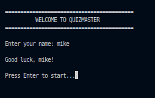
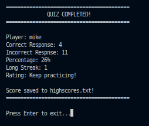
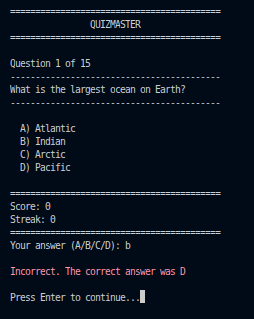
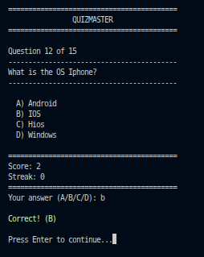
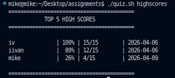

# 🎮 QuizMaster — Bash Terminal Quiz Game

A fully interactive quiz game that runs directly in the terminal using Bash.
The game loads questions from a file, randomizes them, tracks player score and streaks, and saves high scores.
This project is designed to push your Bash skills to the next level while staying beginner-friendly.

---

## 🎯 Project Goals

This project aims to:

Practice Bash scripting fundamentals
Work with structured text files
Handle user input and validation
Build an interactive terminal application
Implement data persistence using files

---

## The game includes

Randomized questions, Score tracking, Streak tracking, High score saving, Practice mode, Input validation and formatted terminal output.

---

## 🛠 Tech Stack

**Language**
-Bash (Shell scripting)

**Linux command-line tools Used**
-cat
-shuf
-grep
-sed
-awk
-sort
-head
-date

**Other Tools**
-Git & GitHub

---

## 🖥 Features

-Load quiz questions from a file
-Randomize question order every run
-Interactive terminal interface
-Validate player input (A/B/C/D)
-Track score and longest streak
-Calculate final percentage score
-Save results in highscores.txt
-Display Top 5 high scores
-Practice mode (no scoring)
-Clean terminal UI

---

## 📝 Question File Format

Each question in questions.txt must follow this format:

Question|A) option|B) option|C) option|D) option|Correct letter

Example:

What is the capital of Japan?|A) Beijing|B) Seoul|C) Tokyo|D) Bangkok|C
What is 15 multiplied by 4?|A) 45|B) 60|C) 55|D) 70|B

---

## 🎮 Gameplay Flow

Player enters name
Questions load and shuffle randomly
Each question is displayed with 4 choices
Player answers using A / B / C / D
Score and streak are tracked
Final results are displayed
Score is saved to highscores.txt

---

## 📷 Example Output

### Normal Mode

 

 

## View Top Scores

### Practice Mode

**Practice mode**
-No scoring
-No high score saving
-Displays correct answer after each question
-Perfect for learning and testing knowledge

 

---

## 📂 Project Files

You must create these files:

quiz-game/
├── assets
│   └── images
│       ├── endgame.png
│       ├── gameui1.png
│       ├── gameui2.png
│       ├── practice1.png
│       ├── practice2.png
│       ├── start.png
│       └── topscore.png
├── highscores.txt
├── questions.txt
├── quiz.sh
└── README.md

## Clone the repository

git clone <https://github.com/mike2377/terminal_quiz_game.git>
cd terminal_quiz_game

Give execution permission to the script:

chmod +x quiz.sh

Run the script:

Run normal mode (scores saved):

./quiz.sh

Run practice mode:

./quiz.sh practice

Show high scores:

./quiz.sh highscores

---

🧠 Challenges Faced

Parsing structured data using IFS
Randomizing arrays in Bash
Validating user input safely
Tracking streaks and percentages
Implementing persistent high scores
Designing an interactive program flow

📚 What I Learned

Reading and parsing files in Bash
Using arrays and functions
Handling user input and validation
Building interactive CLI programs
Saving and sorting persistent data

🚀 Future Improvements

Add difficulty levels
Add timer per question

👨🏽‍💻 Author

Kembou Keumoe Ivan Michael
Junior Fullstack Developer
📩 Email: <kman39457@email.com>

🌍 Based in Cameroon | Open to remote opportunities
